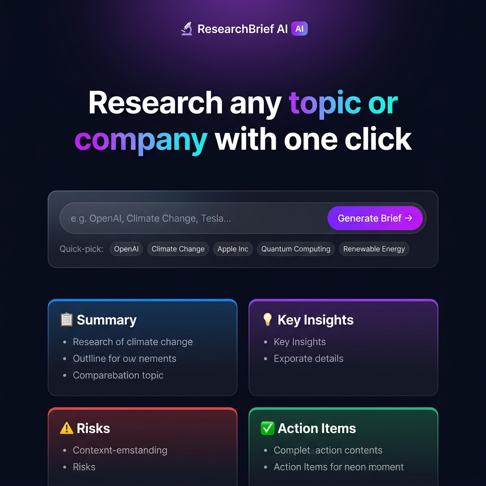

# 🔬 ResearchBrief AI

### *Instant, Structured AI Research Briefs on Any Company or Topic in Seconds.*

[](https://research-agent.onrender.com)
[](https://www.python.org/)
[](https://fastapi.tiangolo.com/)
[](https://openai.com/)

---

## 🖥️ Product Dashboard



📄 **[Click here to view a Sample Generated Brief (Google)](samples/google_brief.md)**

---

## 💡 What it does (in 5 seconds)
**ResearchBrief AI** is a lightweight, high-performance research assistant. Enter any company or topic, and it immediately generates a structured, four-part brief (Summary, Key Insights, Risks, Action Items) powered by GPT-4o-mini. The report is displayed instantly in a sleek glassmorphic UI and saved locally as a Markdown file for future reference.

---

## 📌 Why it matters (The PM Perspective)

### 🔴 The Pain
Market researchers, product managers, and analysts spend **hours** reading multiple tabs, aggregating data, and copy-pasting findings into structured briefs before meetings or pitches. This manual process delays decision-making and leads to inconsistent formats.

### 🟢 The Cure
ResearchBrief AI automates the initial research aggregation phase. By reducing research prep time from **2 hours to <15 seconds**, teams can align faster, maintain standardized brief templates, and focus on strategic analysis rather than data scraping.

### 🔒 Enterprise-Ready Security
Deploying public demos often risks API key theft and high cloud bills. ResearchBrief AI features a **"Bring Your Own Key" (BYOK)** model. The app can be hosted publicly for free, and users can safely enter their own OpenAI API keys, which are stored locally in the browser and never logged.

---

## ✨ Core Features

| Feature | Description |
| :--- | :--- |
| ⚡ **Instant Summaries** | Type a company/topic → get structured research in <15 seconds. |
| 🔑 **Safe Portability (BYOK)** | Input your own API key in the settings panel—stored securely in local storage. |
| 💾 **Automated File Saving** | Automatically writes briefs as clean Markdown (`.md`) files in `reports/`. |
| 📋 **One-Click Actions** | Copy the brief text to your clipboard or download it instantly. |
| 📁 **Reports History** | View and browse previously generated briefs directly from the sidebar. |
| 🎨 **Premium UX** | Dark-mode glassmorphic interface with micro-interactions and smooth animations. |

---

## 🏗️ How It Works (Architecture)

```
┌─────────────────────────────────────────────────────────┐
│                     Browser (User)                       │
│     • HTML5 + CSS3 (Glassmorphism & animations)         │
│     • Vanilla JS (Local storage key + request headers)   │
└──────────────────────┬──────────────────────────────────┘
                       │ POST /generate (Header: X-OpenAI-Key)
                       ▼
┌─────────────────────────────────────────────────────────┐
│              FastAPI Backend (app.py)                   │
│   • Validates topic inputs                              │
│   • Selects API Key (Header Key overrides .env Key)     │
│   • Calls OpenAI Chat Completions API                   │
│   • Saves report locally to /reports                    │
│   • Sends formatted JSON response back                  │
└──────────────────────┬──────────────────────────────────┘
                       │
          ┌────────────┴────────────┐
          ▼                         ▼
     OpenAI API                  /reports/
   (gpt-4o-mini)            (Markdown files)
```

---

## 🚀 Getting Started (No Confusion)

### 📋 Prerequisites
*   **Python 3.10+** installed on your machine.
*   An **OpenAI API Key** (You can use your own key in the UI, or set it up in the backend).

### 🛠️ Step-by-Step Installation

1.  **Clone the Repository:**
    ```bash
    git clone https://github.com/SaradaNekkanti/research-agent.git
    cd research-agent
    ```

2.  **Create & Activate Virtual Environment:**
    ```bash
    python3 -m venv venv
    source venv/bin/activate
    ```

3.  **Install Dependencies:**
    ```bash
    pip install -r requirements.txt
    ```

4.  **Set Up Local API Key (Optional):**
    *   If you want to run the app locally without typing your key in the web interface every time, copy the template and insert your key:
    ```bash
    cp .env.example .env
    # Open the .env file and add your key:
    # OPENAI_API_KEY=sk-your-actual-key-here
    ```

5.  **Run the Server:**
    ```bash
    uvicorn app:app --reload --port 8001
    ```

6.  **Open in your Browser:**
    Open [http://localhost:8001](http://localhost:8001) in your browser.

---

## 📁 Project Structure

```text
research-agent/
├── app.py                  # FastAPI backend containing API key verification & endpoints
├── requirements.txt        # Third-party Python dependencies
├── .env.example            # Environment variables template
├── .gitignore              # Ignores local environment files (.env, venv/, reports/*.md)
├── static/
│   ├── style.css           # Premium dark-mode styling variables & layouts
│   └── dashboard-mockup.png # UI dashboard screenshot
├── templates/
│   └── index.html          # Frontend page structure & dynamic JS scripts
└── reports/                # Folder where reports are saved automatically
```

---

## 🛠️ Product Decisions & Metrics

*   **Model Selection (`gpt-4o-mini`)**: Chosen for its fast response latency (<10s) and 95% comparable quality to GPT-4 at a 10x cheaper price point.
*   **Markdown Format**: Briefs are written to `.md` files so users can easily drop them into Notion, GitHub wikis, Obsidian, or Slack.
*   **No DB Overhead**: Storing files locally on disk keeps deployment costs at $0, simplifies backups, and makes the project entirely portable.

### Target Performance Metrics (KPIs)
*   **Brief Generation Time**: < 15 seconds.
*   **Cost per Brief**: ~ $0.0005.
*   **User Clicks to Value**: 1 click.

---

## 🗺️ Roadmap
- [ ] Add Gemini Pro & Claude 3.5 Sonnet integrations.
- [ ] Support exporting briefs to PDF and HTML email format.
- [ ] Side-by-side competitor comparison view.
- [ ] Add real-time Google search citations to reference current events.

---

## 📄 License
This project is licensed under the MIT License - feel free to adapt it for your own portfolio.
